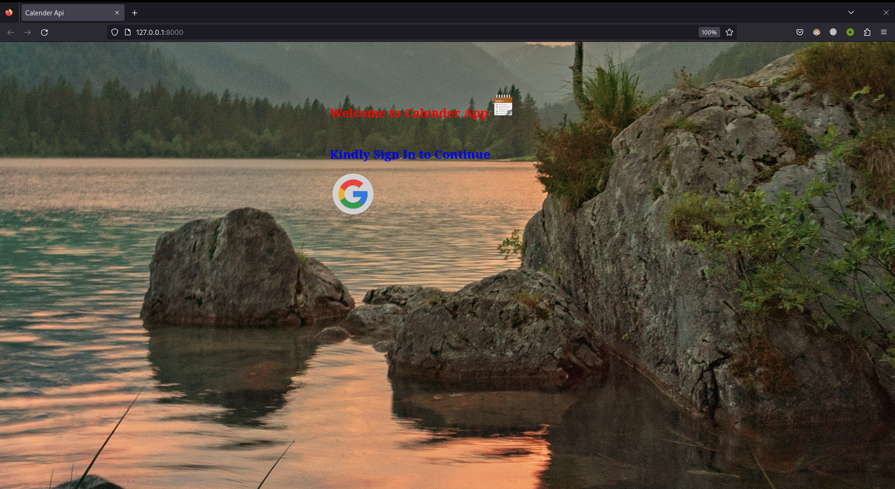
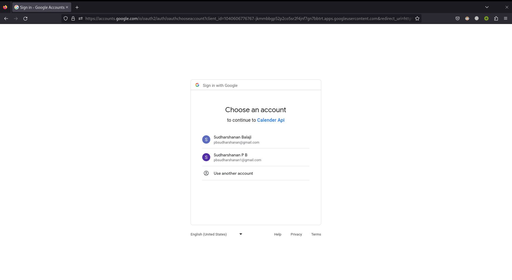
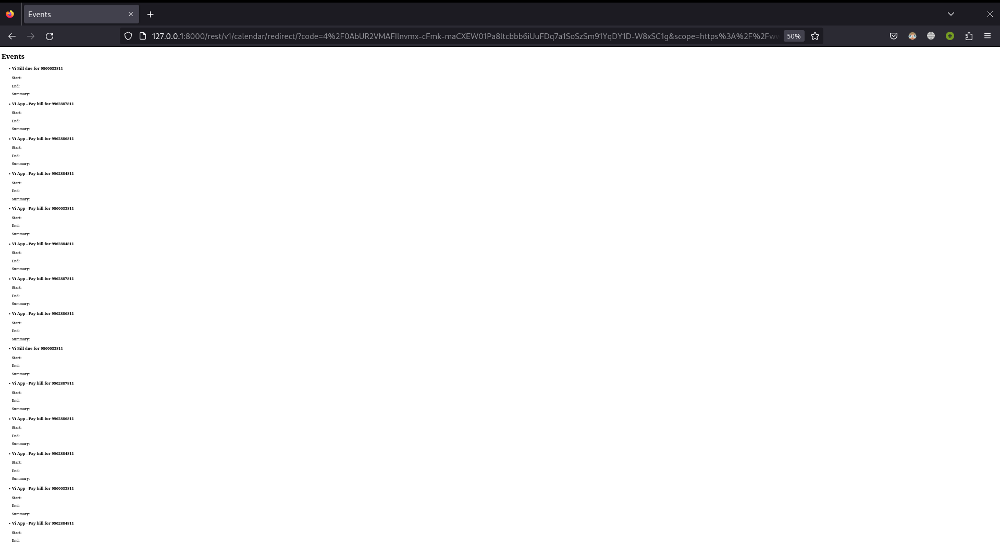
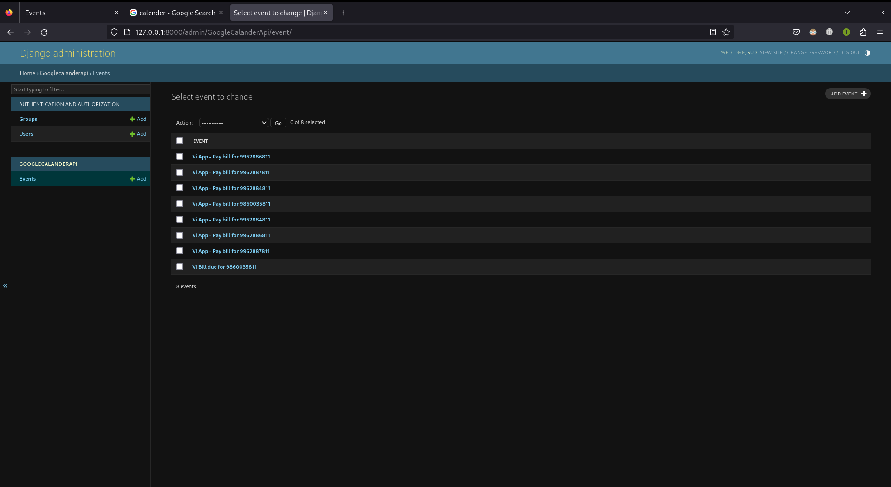
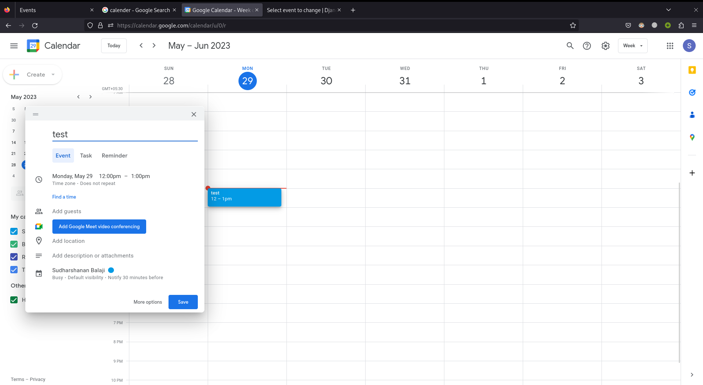
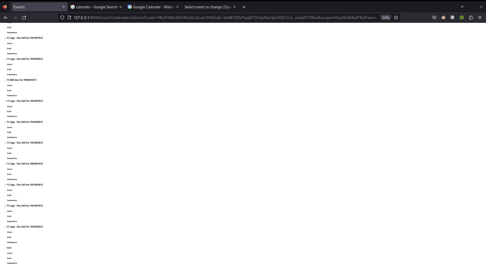
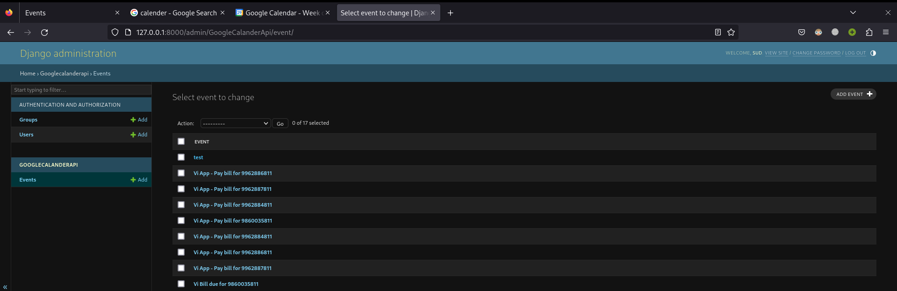

# Google Calender API

This app gets the list of events in the users google calender. To get authorization the app uses google's
OAuth2 verification. Once the user verifies his mail he will be prompted with his event in the calender in the
form of a list.

## Features
<ul>
    <li> Secure </li>
    <li> When the event is added on refresh the new event is also displayed </li>
    <li> All the Events are stored in a Database for future use </li>
</ul>

## App Images

### Google OAuth2

### Display Events

### Events in Database

### Adding new event in calender

### Displaying the updated event on refresh

### Updated entries in DB

